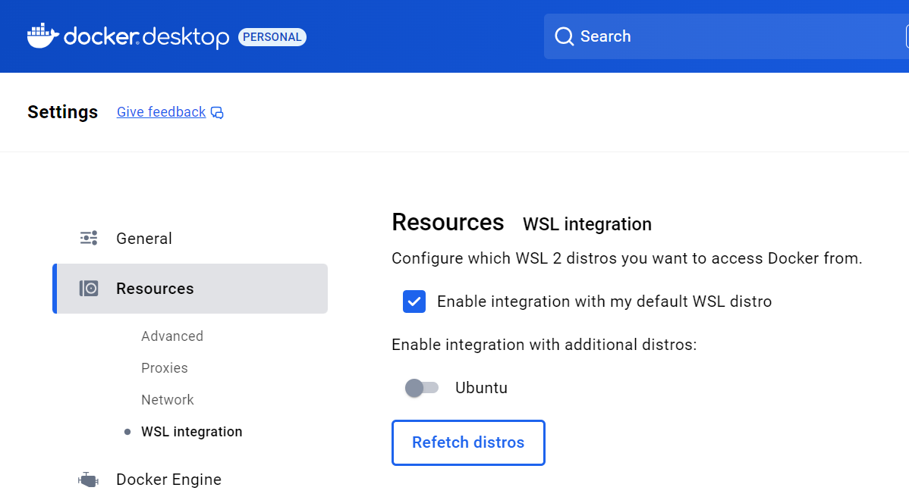
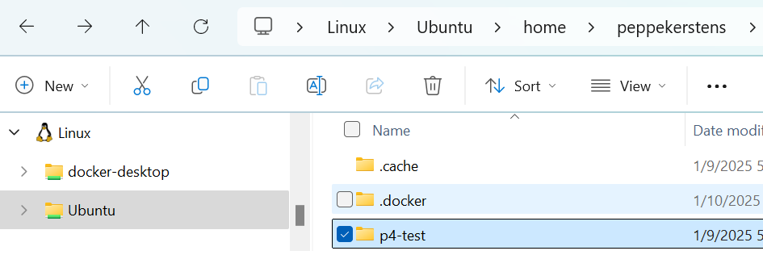

# SONiC

In case you have not heard; SONiC is supposedly the latest and greatest in networking OS-es. To quote [the website](https://sonicfoundation.dev/):

*"Software for Open Networking in the Cloud (SONiC) is an open source network operating system (NOS) based on Linux that runs on switches from multiple vendors and ASICs"*

It should bring us a unified management interface for differente hardware and faster development of new features with better intergration between different hardware. Sounds to good to be true...

## The use case

As it turnes out, I have been asked to help out building an ~~Azure HCI~~ ~~Azure Stack~~ [Azure Local](https://azure.microsoft.com/products/local) (come on Microsoft, really?) stamp for internal use in my company. Probably because of my experience with building and maintaining [VMM](https://learn.microsoft.com/system-center/vmm/overview)/[Azure Pack](https://learn.microsoft.com/previous-versions/azure/windows-server-azure-pack) environments on the past. But this has been around 2014-2019 I believe. Ancient history in IT terms.

Even though much of the management interfacing has changed, core technology components (Clustering, Hyper-V, Storage Spaces) and requirements not so much. It was critical to have networking and network interfacing absolutaly correctly and homogeneously configured. With this I mean *every* aspect of the network stack, including firmare, switching, drivers etcetera.

Even back then, I left most of the network configuration details to others and had already started to focus more on automated deployments. Current situation does not differ that much; I believe to have some very proficient colleagues capable of configuring the needed networking just fine. That being said, the company policy to use SONiC as default switch OS is new. So the kremlins in my head are screaming that I needed to brush-up on networking technology and configuration proficiency fast...

## SONiC emulator

The get to know any new system, it is quite common to start with an emulator. Especially concerning networking devices as their investment can be severe and need to endure.

Diving down deeper into the rabbit hole, I stumbled upon the [official SONiC github wiki and noticed that the provided software switch](https://github.com/sonic-net/SONiC/wiki/SONiC-P4-Software-Switch) to use as a test-bed [is not support anymore](https://github.com/sonic-net/SONiC/issues/1429).

The github repo seems to be maintained quite badly overall. This to me seems not like good sign for any organization trying to advocate their emerging technology. Especially not when the claim is that it is open source.

So I looked elsewhere for sources. It first a came across [the CISCO 8000 emulator](https://blogs.cisco.com/developer/8000vemulatorsandboxsonic01). But this turned out to be a sandbox environment, hosted by CISCO, which you need to sign-up for, request and receive a ~6 hour period availability after going through hoops and loops. Too restricted time frame wise; I tend to work on this over many days in short time sprints and too little freedom to do as like. Not my cup of tea.

Then I stumbled upon a [writeup by 'Adam Dunstan' on Medium](https://medium.com/sonic-nos/creating-a-sonic-nos-virtual-lab-5a9ec431e0d0). Don't know him and have no affiliation with him whatsoever. This le dme in the right direction. So thank you Adam! 

## The SONiC github wiki scenario

First focus is getting the [official SONiC github wiki scenario](https://github.com/sonic-net/SONiC/wiki/SONiC-P4-Software-Switch) working via Docker again. This assumes a debian Linux based host, so lets replicate that. 

### Ubuntu on Windows Subsystem for Linux

Docker was already on my Windows system. This install uses Windows Subsystem for Linux (WSL) as a container host. Docker installs its own distribution. This distribution lacks the apt-get functionality being used in severall scripts and scenarios. So we need a Debian based Linx distribution like Ubuntu. 

```cmd
wsl --list --online

wsl --install ubuntu
```

During installation, you will be requested to enter credentials. After that you will be redirected into that distribution. Lets first bring the system up-to-date.

```sh
sudu su
apt-get update
apt-get upgrade
```

After closing the Ubuntu shell, the way to get back in is to either make Ubuntu default -or- open it specifically. I did not change the default distro to Ubuntu. 

```cmd
wsl --set-default ubuntu
```

```cmd
wsl --distribution ubuntu
```

Back into PowerShell, we can check on the existence of the distribution

```cmd
wsl --list
Windows Subsystem for Linux Distributions:
docker-desktop (Default)
Ubuntu
```

There is probably a commandline option for this, but I stumbled upon this setting within docker desktop. I enabled Ubuntu and restarted docker desktop.



The docker engine is already running in the docker distro, but not in Ubuntu. Let's cherry pick some command's from the scripts supplied with the original SONiC-P4 scenario. Download the scripts [here](./assets/SONiC-P4.Test.tar.gz) or from [original location](https://github.com/sonic-net/SONiC/wiki/files/SONiC-P4/SONiC-P4.Test.tar.gz).

After unzipping, copy-over the scripts into Ubuntu. I put it under $home 



after logging into Ubuntu distro again

```cmd
wsl --distribution ubuntu
```

```sh
cd $home
pwd
/home/peppekerstens
cd p4-test
chmod 777 *
sudo ./install_docker_ovs.sh
```

What I found peculiar is that, after installation of Docker on Ubuntu, an inquiry of present docker images, show me the images I installaed earlier for testing Windows on Docker

```cmd
docker images

REPOSITORY        TAG       IMAGE ID       CREATED         SIZE
dockurr/windows   latest    219f9419bcb3   2 weeks ago   605MB
```

## Getting an image

As new builds are being published regularly, it makes sense to detect latest official build first [here](
https://sonic-build.azurewebsites.net/ui/sonic/Pipelines). Look for the latest version of 'Azure.sonic-buildimage.official.vs', go to 'build history' and then in top row, choose 'Artifacts'.

You will end up running into another list of files. These files represent solutions, build for several platforms (OSses). A list of commonly used hypervisors and container below:

| platform | image name |
| -- | -- |
| Docker | target/docker-sonic-vs.img.gz |
| KVM | target/sonic-vs.img.gz |
| Hyper-V | target/sonic-vs.vhdx |

For my purpose I downloaded the Docker image. Next I imported and named it. By default, both REPOSITORY and TAG is \<none\>.

```cmd
docker import "[path to]\docker-sonic-vs.gz"

docker images
REPOSITORY        TAG       IMAGE ID       CREATED         SIZE
<none>            <none>    a90ab087540a   2 minutes ago   1.05GB

docker tag a90ab087540a sonic202411

docker images
REPOSITORY        TAG       IMAGE ID       CREATED       SIZE
sonic202411       latest    a90ab087540a   4 hours ago   1.05GB
```

```sh
peppekerstens@pk-private:/mnt/c/Users/peppe/downloads$ docker load < ./docker-sonic-vs.gz
Loaded image: docker-sonic-vs:latest
peppekerstens@pk-private:/mnt/c/Users/peppe/downloads$ docker image pull ubuntu
Using default tag: latest
latest: Pulling from library/ubuntu
de44b265507a: Download complete
Digest: sha256:80dd3c3b9c6cecb9f1667e9290b3bc61b78c2678c02cbdae5f0fea92cc6734ab
Status: Downloaded newer image for ubuntu:latest
docker.io/library/ubuntu:latest
peppekerstens@pk-private:/mnt/c/Users/peppe/downloads$ docker images
REPOSITORY        TAG       IMAGE ID       CREATED        SIZE
sonic202411       latest    a90ab087540a   5 hours ago    1.05GB
docker-sonic-vs   latest    026ca9c79e93   28 hours ago   1.74GB
dockurr/windows   latest    219f9419bcb3   2 weeks ago    605MB
ubuntu            latest    80dd3c3b9c6c   7 weeks ago    117MB
```

Now we need to change a few things in the start.sh script. You can of course use your favorite editor for this, either from Windows or Linux.

```sh
cd $home
cd p4-test
nano start.sh
```

changed lines

```sh
sudo docker run --net=none --privileged --entrypoint /bin/bash --name switch1 -it -d -v $PWD/switch1:/sonic docker-sonic-vs:latest
sudo docker run --net=none --privileged --entrypoint /bin/bash --name switch2 -it -d -v $PWD/switch2:/sonic docker-sonic-vs:latest
sudo docker run --net=none --privileged --entrypoint /bin/bash --name host1 -it -d ubuntu:latest 
sudo docker run --net=none --privileged --entrypoint /bin/bash --name host2 -it -d ubuntu:latest
```

running after this, runnig start.sh ....failed. It was obvious that the containers had started.

```sh
peppekerstens@pk-private:~/p4-test$ ./start.sh
[sudo] password for peppekerstens:
c75b11d401d81abd9a329e87597030d095ee2404a79a900663bc2cdca851d09a
e95c7d3dc27162ba3df91159f82e58a987f5c5ebf11b89681cd6e94fe89f9e09
111a3e0935de5d7bceb8b09088870a5a72eced4e418f1df26e78115bacb08edb
906c6d6c5a908b584093d0ddfd33daf6a25726f010f8900ab7dace33c6199726
```

so I executed command line for line

```sh
peppekerstens@pk-private:~/p4-test$ sudo ovs-vsctl add-br switch1_switch2
ovs-vsctl: cannot create a bridge named switch1_switch2 because a bridge named switch1_switch2 already exists
peppekerstens@pk-private:~/p4-test$ sudo ovs-docker add-port switch1_switch2 sw_port0 switch1
/usr/bin/ovs-docker: 9: Syntax error: newline unexpected
peppekerstens@pk-private:~/p4-test$ sudo ovs-docker add-port switch1_switch2 sw_port0 switch1
/usr/bin/ovs-docker: 9: Syntax error: newline unexpected
peppekerstens@pk-private:~/p4-test$ sudo ovs-docker add-port switch1_switch2 sw_port0 switch1
/usr/bin/ovs-docker: 9: Syntax error: newline unexpected
peppekerstens@pk-private:~/p4-test$ ovs-docker add-port switch1_switch2 sw_port0 switch1
/usr/bin/ovs-docker: line 8: syntax error near unexpected token `newline'
/usr/bin/ovs-docker: line 8: `<!DOCTYPE html>'
peppekerstens@pk-private:~/p4-test$ ovs-docker add-port
/usr/bin/ovs-docker: line 8: syntax error near unexpected token `newline'
/usr/bin/ovs-docker: line 8: `<!DOCTYPE html>'
peppekerstens@pk-private:~/p4-test$ ovs-docker
/usr/bin/ovs-docker: line 8: syntax error near unexpected token `newline'
/usr/bin/ovs-docker: line 8: `<!DOCTYPE html>'
```

Hmmm strange. Seems like something is wrong with the ovs-docker command. Let's try another route.

https://docs.openvswitch.org/en/latest/intro/install/distributions/#debian-ubuntu

First lets fix apt, because the install_docker_ovs.sh script seeminlge has messed things up

```sh
peppekerstens@pk-private:~/p4-test$ sudo apt-get update
Hit:1 http://archive.ubuntu.com/ubuntu noble InRelease
Hit:2 http://security.ubuntu.com/ubuntu noble-security InRelease
Get:3 http://archive.ubuntu.com/ubuntu noble-updates InRelease [126 kB]
Ign:4 https://apt.dockerproject.org/repo ubuntu-noble InRelease
Hit:5 http://archive.ubuntu.com/ubuntu noble-backports InRelease
Ign:4 https://apt.dockerproject.org/repo ubuntu-noble InRelease
Ign:4 https://apt.dockerproject.org/repo ubuntu-noble InRelease
Err:4 https://apt.dockerproject.org/repo ubuntu-noble InRelease
  Something wicked happened resolving 'apt.dockerproject.org:https' (-5 - No address associated with hostname)
Fetched 126 kB in 7s (17.1 kB/s)
Reading package lists... Done
W: Failed to fetch https://apt.dockerproject.org/repo/dists/ubuntu-noble/InRelease  Something wicked happened resolving 'apt.dockerproject.org:https' (-5 - No address associated with hostname)
W: Some index files failed to download. They have been ignored, or old ones used instead.
```

So remove the remote repository

```sh
cd /etc/apt/sources.list.d
ls -al
total 16
drwxr-xr-x 2 root root 4096 Jan 10 18:58 .
drwxr-xr-x 8 root root 4096 Jan 10 18:57 ..
-rw-r--r-- 1 root root  122 Jan 10 17:25 archive_uri-https_apt_dockerproject_org_repo_-noble.list
-rw-r--r-- 1 root root 2552 Sep 27 22:14 ubuntu.sources

sudo rm archive_uri-https_apt_dockerproject_org_repo_-noble.list
```

```sh
sudo apt-get remove openvswitch-switch
sudo apt-get install openvswitch-switch
```

same error. as it turns out, follow line in `install_docker_ovs.sh` 

```sh
sudo curl -L https://github.com/openvswitch/ovs/raw/master/utilities/ovs-docker -o /usr/bin/ovs-docker
```

should be replaced by

```sh
sudo curl -L https://raw.githubusercontent.com/openvswitch/ovs/refs/heads/main/utilities/ovs-docker -o /usr/bin/ovs-docker
```

lets retry...


\* One reason is that I really dislike Medium who seems to be more interested in logging your online behavior and monotizing on information than anything else. Everytime I am forced to accept their cookie policy i get a clickbait feeling. 


