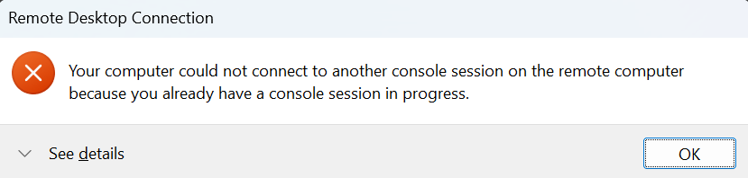

# Docker

Windows Sandbox did not deliver. I still need a solution for testing. Being part of Windows already, the obvious choice and easy route here might have been Hyper-V.

But I stumbled upon this [video](https://www.youtube.com/watch?v=xhGYobuG508). It points to [this github repository](https://github.com/dockur/windows). To install a complete Windows OS in a Docker container you only need Docker itself and [a compose file](https://docs.docker.com/compose/intro/compose-application-model/#the-compose-file).

## Installing Docker

Docker should be downloaded from the official site. I installed Docker on a Windows host. During installation, you can choose between WSL and Hyper-V. WSL is recommended, so I chose that. Be aware that you can't run both Hyper-V and WSL2 on a single system. 

> ### WSL vs Hyper-V
> In case you are wondering, Microsoft markets WSL as being '[the latest and greatest in virtualization technology](https://learn.microsoft.com/en-us/windows/wsl/compare-versions#comparing-wsl-1-and-wsl-2)'. But it remains the Hyper-V core, detectable as "Virtual Machine Platform" with a different feature set, contained in "Windows Subsystem for Linux". This is not a bad thing per se; while Hyper-V is not available on Windows Home, WSL2 is.

## Activating the container

It has been a while since last time I fiddled with Docker. I expected Docker Compose to have an interface within the Docker GUI, but I could not find one. So I wound up creating [a file](https://docs.docker.com/compose/intro/compose-application-model/#the-compose-file) in C:\Docker\Windows\compose.yaml with follwing content:

```YAML
services:
  windows:
    image: dockurr/windows
    container_name: windows
    environment:
      VERSION: "11"
    devices:
      - /dev/kvm
      - /dev/net/tun
    cap_add:
      - NET_ADMIN
    ports:
      - 8006:8006
      - 3389:3389/tcp
      - 3389:3389/udp
    stop_grace_period: 2m
``` 

Then within the Docker GUI, I started a Terminal session which in turn started PowerShell. Ah, known territory. Following [the Docker documentation](https://docs.docker.com/compose/intro/compose-application-model/#the-compose-file) I typed `docker compose up`, which started the whole process.

It took about 30 minutens before I had a usable Windows 11 session. Half of it was spend on downloading the media, the other half on prepping Windows. 

## Networking

While being on the host, I could only connect to the noVNC port via https:/localhost:8006. RDP (mstsc.exe) complains about having another console in progress



It *is* possible to connect to the container via RDP, just not via the host directly using above configuration. Most likely due to the fact that port 3389 already is being used by the host system. 

There seem to be 2 ways to connect to an container:

1. Network Address Translation(NAT): The container re-uses the IP address of the host. A container's [service port is remapped](https://docs.docker.com/engine/network/packet-filtering-firewalls/#port-publishing-and-mapping) to another one on your host to make it reachable. This is the default setting
2. [Create a routed network](https://docs.docker.com/engine/network/packet-filtering-firewalls/#direct-routing) on your host using network bridging. This enables direct addressing containers. Preferred when working with Ipv6

At this point, I just needed a quick solution. There is immediate need to research the networking options. I'll relay that to when I might test Docker as a container solution on a home server of sorts.

I ended up mapping the default RDP ports to non-standard ones like so:

```YAML
    ports:
      - 8006:8006
      - 33389:3389/tcp
      - 33389:3389/udp
``` 

After installation, RDP is available via `mstsc /v:localhost:33389`, even on the host itself


## Using a local copy of Windows

The dockurr/windows container download Windows first. This a nice feature when starting from scratch. To expedite the first boot, you can choose to download the ISO and point to that local copy. This saves a lot of boot-up time.

Microsoft allows for an ISO to be downloaded, check here: https://www.microsoft.com/software-download/windows11


```YAML
services:
  windows:
    image: dockurr/windows
    container_name: windows
    volumes:
      - C:/Docker/Windows/Win11_24H2_EnglishInternational_x64.iso:/custom.iso
    devices:
      - /dev/kvm
      - /dev/net/tun
    cap_add:
      - NET_ADMIN
    ports:
      - 8006:8006
      - 33389:3389/tcp
      - 33389:3389/udp
    stop_grace_period: 2m
```

Now, first boot is marginally quicker. It seems like the ISO needs to be copied first to slipstream the configuration for the automated installation after that.

Even though this setup is not super fast, it is quick enough for occasional testing. 

https://learn.microsoft.com/en-us/training/modules/run-containers-windows-server/?source=recommendations
https://learn.microsoft.com/en-us/virtualization/windowscontainers/quick-start/set-up-environment?tabs=dockerce


