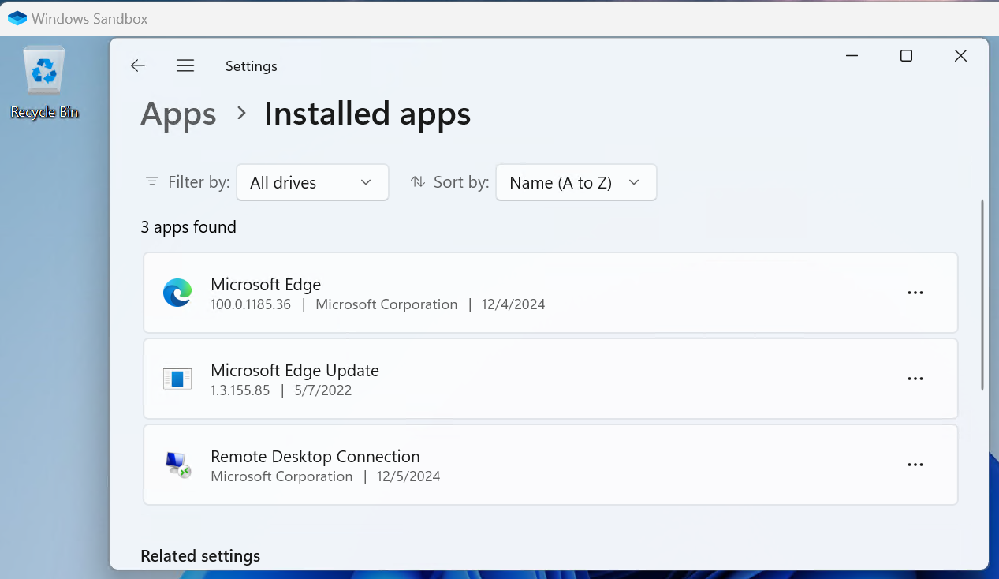

# Windows Sandbox Configuration

A recent option to create a temporary test machine is Windows Sandbox. This is a virtual machine instance based upon your current Windows installation. It requires less resources then a normal VM, yet exposes a full Windows installation. 

It uses same principles as other containerized solutions, like Docker, presenting a vanilla OS every time the instance starts. It is stateless. Settings and applications need to be applied again after at respawn. Statefull information needs to be saved outside of the VM.

More information on basic configuration can be found [here](https://learn.microsoft.com/en-us/windows/security/application-security/application-isolation/windows-sandbox/windows-sandbox-configure-using-wsb-file)

## Testing Minimal Windows

My first use case was the minimal windows scenario. It took me a bit of work to set it up. 

The contents of C:\WindowsSandbox\MinimalWindows.wsb are displayed below. It enables access to C:\WindowsSandbox on the host system into the Sandbox via C:\Users\WDAGUtilityAccount\Downloads.

Apparently, running scripts within Windows Sandbox is not allowed, so you need to force it.

```XML
<Configuration>
  <MappedFolders>
    <MappedFolder>
      <HostFolder>C:\WindowsSandbox</HostFolder>
      <SandboxFolder>C:\Users\WDAGUtilityAccount\Downloads</SandboxFolder>
      <ReadOnly>true</ReadOnly>
    </MappedFolder>
  </MappedFolders>
  <LogonCommand>
    <Command>powershell -executionpolicy remotesigned C:\Users\WDAGUtilityAccount\Downloads\PrepareSandbox.ps1</Command>
  </LogonCommand>
</Configuration>
```

The contents of C:\WindowsSandbox\PrepareSandbox.ps1 are displayed below. In here, execution of scripts is enabled. The start-process commands may look a bit silly. Logon commands run the background, 
this forces the actions to become vieweable within the console. 

```PowerShell
Set-ExecutionPolicy RemoteSigned -Force

start-process -filepath "powershell" -argumentlist "-command C:\Users\WDAGUtilityAccount\Downloads\install-winget.ps1"  -Wait

start-process -filepath "winget" -argumentlist "configure -f C:/Users/WDAGUtilityAccount/Downloads/remove-bing-components.dsc.yaml --disable-interactivity --wait"

start-process -filepath "winget" -argumentlist "--logs" 
``` 

The contents of C:\WindowsSandbox\install-winget.ps1 are displayed below. WinGet is not present within the Sandbox system (this should have been a clear hint already, see ). So this script installs it.

```PowerShell
#Requires -RunAsAdministrator

function install-winget{
  Try{
    Get-PackageProvider -Name NuGet -ListAvailable -ErrorAction Stop
  }Catch{
    Install-PackageProvider -Name NuGet -MinimumVersion 2.8.5.201 -Force
  }

  #https://powershellisfun.com/2024/11/28/using-the-powershell-winget-module/
  $winget = Get-Module -Name Microsoft.WinGet.Client -ListAvailable
  If ($null -eq $winget){
      Install-Module -Name Microsoft.WinGet.Client -Force
  }
  Import-Module -Name Microsoft.WinGet.Client

  #Check Winget
  Repair-WinGetPackageManager -Latest
}

install-winget
```

The contents of C:\WindowsSandbox\remove-bing-components.dsc.yaml are displayed below. This only removes the Bing components from Windows as a testcase.

```YAML
# yaml-language-server: $schema=https://aka.ms/configuration-dsc-schema/0.2
properties:
  assertions:
    - resource: Microsoft.Windows.Developer/OsVersion
      directives:
        description: Verify min OS version requirement
        allowPrerelease: true
      settings:
        MinVersion: '10.0.22000'
  resources:
    - resource: Microsoft.WinGet.DSC/WinGetPackage
      id: BingNews
      directives:
        description: Remove Bing News
        allowPrerelease: true
      settings:
        id: Microsoft.BingNews
        source: winget
        Ensure: Absent
    - resource: Microsoft.WinGet.DSC/WinGetPackage
      id: BingWeather
      directives:
        description: Remove Bing Weather
        allowPrerelease: true
      settings:
        id: Microsoft.BingWeather
        source: winget
        Ensure: Absent
    - resource: Microsoft.WinGet.DSC/WinGetPackage
      id: BingSearch
      directives:
        description: Remove Bing Search
        allowPrerelease: true
      settings:
        id: Microsoft.BingSearch
        source: winget
        Ensure: Absent
  configurationVersion: 0.2.0
```

I was so focussed on getting it working that only when it finally did, it daunted on me that the Sandbox environment apparently already is a minimal Windows environment. Nearly nothing is present.

